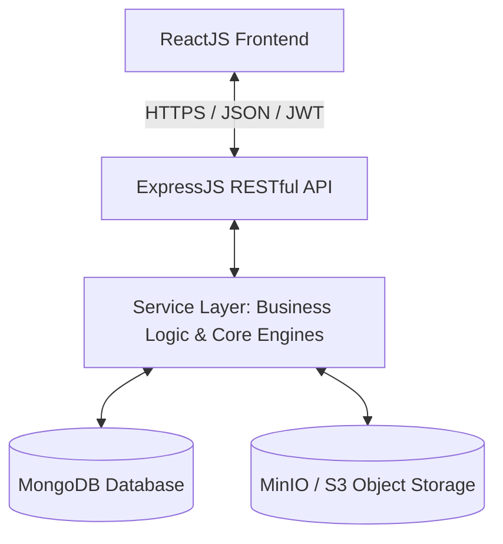

# Tài liệu Thiết kế Phần mềm (SDD)
## Dự án: ART-AI (Academic Research Transparency & AI Audit System)
### Hệ thống Giám sát Minh bạch và Kiểm chứng Nhật ký AI trong Nghiên cứu Khoa học

---

## 1. Giới thiệu (Introduction)

### 1.1. Mục đích
Tài liệu Thiết kế Phần mềm (SDD) này cung cấp các mô tả chi tiết về mặt kỹ thuật, kiến trúc hệ thống, cấu trúc dữ liệu cơ sở dữ liệu MongoDB và thiết kế API cho dự án ART-AI. Tài liệu này đóng vai trò định hướng triển khai mã nguồn cho các kỹ sư phát triển backend và frontend.

### 1.2. Mục tiêu thiết kế
* **Hiệu năng cao**: Tối ưu hóa truy vấn thông qua việc nhúng snapshot trực tiếp thay vì join dữ liệu phức tạp.
* **Bảo mật tối đa**: Sử dụng cơ chế phân quyền RBAC và mã hóa JWT nghiêm ngặt.
* **Mở rộng dễ dàng**: Phân tầng nghiệp vụ rõ ràng (Model-View-Controller & Service Pattern).

---

## 2. Kiến trúc Hệ thống (System Architecture)

### 2.1. Tổng quan kiến trúc phần mềm
Hệ thống tuân thủ mô hình **Client-Server** với giao diện người dùng ReactJS (Frontend) độc lập và dịch vụ backend NodeJS + ExpressJS (RESTful API), trao đổi dữ liệu định dạng JSON.



### 2.2. Luồng xử lý yêu cầu (Request Flow)
Mọi yêu cầu từ client gửi lên API Backend phải đi qua luồng tuần tự sau để đảm bảo tính an toàn và đúng đắn:

```
Client Request
      ↓
Route Endpoint
      ↓
Authentication Middleware (Xác thực JWT Token)
      ↓
Authorization Middleware (Kiểm tra quyền Role: student, lecturer, subject_head, admin)
      ↓
Validation Middleware (Kiểm tra và lọc dữ liệu đầu vào bằng express-validator)
      ↓
Controller (Trích xuất request data, gọi Service, không chứa nghiệp vụ)
      ↓
Service (Chứa nghiệp vụ chính, tính toán, kết nối cơ sở dữ liệu)
      ↓
Database Service / Storage Service (Kết nối MongoDB / Object Storage)
      ↓
MongoDB / MinIO S3
      ↓
Response (Trả kết quả định dạng JSON chuẩn về Client)
```

---

## 3. Thiết kế Cơ sở Dữ liệu (Database Design)

Hệ thống sử dụng cơ sở dữ liệu phi quan hệ MongoDB. Các tên Collection được ánh xạ qua các biến môi trường cấu hình trong file `.env`.

### 3.1. Sơ đồ Quan hệ Dữ liệu (ERD)

```mermaid
erDiagram
    User ||--o{ ClassSnapshot : "lecturer/students in"
    Class ||--|| User : "has lecturer snapshot"
    Class ||--o{ StudentSnapshot : "has student list"
    Class ||--o{ GradeItem : "has milestones"
    GradeItem ||--o{ Submission : "contains"
    User ||--o{ Submission : "submits"
    Submission ||--o{ AiInteraction : "declares"
    Submission ||--|| AiEvaluation : "has engine report"
    Submission ||--o{ SubmissionFlag : "has"
    Submission ||--|| SubmissionReview : "has comment"
    Submission ||--|| Grade : "has score"
    User ||--|| FinalResult : "has"
    Class ||--o{ FinalResult : "calculates for"
    User ||--o{ Notification : "receives"
```

### 3.2. Đặc tả chi tiết các Collection

#### 3.2.1. Collection: `users`
*Lưu trữ thông tin người dùng toàn hệ thống.*
* **Indexes**: `{ email: 1 }` (unique), `{ studentCode: 1 }` (unique, sparse).

| Tên Trường | Kiểu Dữ Liệu | Ràng Buộc | Mô Tả |
| :--- | :--- | :--- | :--- |
| `_id` | ObjectId | Primary Key | Định danh duy nhất của người dùng |
| `uuid` | String | Required, Unique | Mã định danh duy nhất (UUID v4) |
| `email` | String | Required, Unique | Địa chỉ email đăng nhập |
| `passwordHash` | String | Required | Mật khẩu đã được băm (bcrypt) |
| `fullName` | String | Required, Trim | Họ và tên đầy đủ |
| `studentCode` | String | Nullable, Trim | Mã số sinh viên (chỉ dành cho student) |
| `role` | String | Required | Vai trò: `student`, `lecturer`, `subject_head`, `admin` |
| `isActive` | Boolean | Default: `true` | Trạng thái tài khoản |
| `profile` | Object | Default: `{}` | Thông tin cá nhân bổ sung (avatar, phone...) |
| `createdAt` | Date | System | Thời điểm tạo tài khoản |
| `updatedAt` | Date | System | Thời điểm cập nhật tài khoản |

#### 3.2.2. Collection: `refresh_tokens`
*Lưu trữ Refresh Token dùng để cấp lại Access Token.*

| Tên Trường | Kiểu Dữ Liệu | Ràng Buộc | Mô Tả |
| :--- | :--- | :--- | :--- |
| `_id` | ObjectId | Primary Key | Định danh duy nhất |
| `token` | String | Required, Unique | Chuỗi token đã mã hóa |
| `userId` | ObjectId | Ref: 'User', Required | Tham chiếu người dùng sở hữu |
| `createdAt` | Date | System | Thời điểm tạo |
| `updatedAt` | Date | System | Thời điểm cập nhật |

#### 3.2.3. Collection: `classes`
*Lưu trữ thông tin lớp học và nhúng snapshots để tăng tốc độ đọc dữ liệu.*
* **Indexes**: `{ classCode: 1 }` (unique), `{ "lecturer.lecturerId": 1 }`, `{ "students.studentId": 1 }`.

| Tên Trường | Kiểu Dữ Liệu | Ràng Buộc | Mô Tả |
| :--- | :--- | :--- | :--- |
| `_id` | ObjectId | Primary Key | Định danh duy nhất lớp học |
| `classCode` | String | Required, Unique | Mã lớp học (ví dụ: SE1701) |
| `subjectName` | String | Required, Trim | Tên môn học |
| `semester` | String | Required, Trim | Học kỳ (ví dụ: Summer 2026) |
| `academicYear` | String | Required, Trim | Năm học (ví dụ: 2025-2026) |
| `lecturer` | Object | Required | Snapshot Giảng viên: `{ lecturerId, fullName, email }` |
| `students` | Array | Default: `[]` | Danh sách Snapshot Sinh viên: `[{ studentId, studentCode, fullName, email }]` |
| `isActive` | Boolean | Default: `true` | Trạng thái hoạt động của lớp |
| `createdAt` | Date | System | Thời điểm tạo |
| `updatedAt` | Date | System | Thời điểm cập nhật |

#### 3.2.4. Collection: `grade_items`
*Các cột điểm của Syllabus.*
* **Indexes**: `{ classId: 1, sequenceOrder: 1 }`.

| Tên Trường | Kiểu Dữ Liệu | Ràng Buộc | Mô Tả |
| :--- | :--- | :--- | :--- |
| `_id` | ObjectId | Primary Key | Định danh duy nhất cột điểm |
| `classId` | ObjectId | Ref: 'Class', Required | Tham chiếu lớp học |
| `title` | String | Required, Trim | Tên cột điểm (ví dụ: Proposal, Lit Review...) |
| `description` | String | Default: `""` | Mô tả chi tiết yêu cầu cột điểm |
| `weight` | Number | Required, 0 to 100 | Trọng số phần trăm trong tổng điểm môn học |
| `maxScore` | Number | Required, Default: `10` | Điểm tối đa của cột điểm này |
| `deadline` | Date | Required | Hạn nộp bài |
| `aiInteractionRequired` | Boolean | Default: `true` | Yêu cầu bắt buộc khai báo nhật ký AI |
| `minAiInteractions` | Number | Default: `5` | Số tương tác tối thiểu phải khai báo |
| `maxAiInteractions` | Number | Default: `10` | Số tương tác tối đa được khai báo |
| `sequenceOrder` | Number | Default: `0` | Thứ tự hiển thị trong tiến trình môn học |
| `isActive` | Boolean | Default: `true` | Trạng thái hoạt động |

#### 3.2.5. Collection: `submissions`
*Lưu trữ thông tin bài nộp và kiểm soát phiên bản.*
* **Indexes**: `{ studentId: 1, gradeItemId: 1, isLatest: 1 }`, `{ classId: 1, gradeItemId: 1 }`, `{ uuid: 1 }` (unique).

| Tên Trường | Kiểu Dữ Liệu | Ràng Buộc | Mô Tả |
| :--- | :--- | :--- | :--- |
| `_id` | ObjectId | Primary Key | Định danh bản nộp |
| `uuid` | String | Required, Unique | Mã định danh duy nhất (UUID v4) |
| `gradeItemId` | ObjectId | Ref: 'GradeItem', Required | Tham chiếu tới cột điểm |
| `classId` | ObjectId | Ref: 'Class', Required | Tham chiếu tới lớp học |
| `studentId` | ObjectId | Ref: 'User', Required | Tham chiếu sinh viên nộp bài |
| `versionNumber` | Number | Required, Default: `1` | Số thứ tự phiên bản (tăng dần 1, 2, 3...) |
| `fileName` | String | Required | Tên file vật lý do sinh viên nộp |
| `fileStorageKey` | String | Required | Key trỏ tới file trên S3/MinIO (VD: bucket/sub_uuid.pdf) |
| `fileSize` | Number | Required | Kích thước file (bytes) |
| `mimeType` | String | Required | Định dạng file (PDF, DOCX, ZIP...) |
| `contentHash` | String | Nullable | Mã MD5/SHA256 để kiểm soát tính toàn vẹn của tệp |
| `status` | String | Required | Trạng thái: `draft`, `submitted`, `evaluated`, `reviewed`, `graded`, `flagged` |
| `submittedAt` | Date | Default: `Date.now` | Thời điểm nộp bài |
| `isLatest` | Boolean | Default: `true` | Đánh dấu đây có phải là phiên bản mới nhất hay không |

#### 3.2.6. Collection: `ai_interactions`
*Lưu trữ nhật ký sử dụng AI do sinh viên khai báo.*
* **Indexes**: `{ submissionId: 1 }`, `{ uuid: 1 }` (unique).

| Tên Trường | Kiểu Dữ Liệu | Ràng Buộc | Mô Tả |
| :--- | :--- | :--- | :--- |
| `_id` | ObjectId | Primary Key | Định danh duy nhất tương tác |
| `uuid` | String | Required, Unique | Mã định danh duy nhất (UUID v4) |
| `submissionId` | ObjectId | Ref: 'Submission', Required | Liên kết tới bản nộp bài |
| `aiTool` | String | Required | Enum: `chatgpt`, `gemini`, `claude`, `copilot`, `other` |
| `usagePurpose` | String | Required | Enum: `brainstorming`, `topic_research`, `summarization`, `writing_improvement`, `critical_feedback`, `methodology_review`, `data_analysis`, `other` |
| `promptContent` | String | Required | Chi tiết câu lệnh sinh viên gửi lên AI |
| `aiResponse` | String | Required | Chi tiết phản hồi nhận được từ AI |
| `studentDecision` | String | Required | Quyết định: `accepted`, `partially_accepted`, `rejected`, `reference_only` |
| `reflectionText` | String | Required | Văn bản tự phản biện/tự giải trình của sinh viên |

#### 3.2.7. Collection: `ai_evaluations`
*Đánh giá tự động của hệ thống về tính minh bạch sử dụng AI.*
* **Indexes**: `{ submissionId: 1 }` (unique), `{ classId: 1 }`, `{ studentId: 1 }`.

| Tên Trường | Kiểu Dữ Liệu | Ràng Buộc | Mô Tả |
| :--- | :--- | :--- | :--- |
| `_id` | ObjectId | Primary Key | Định danh duy nhất |
| `submissionId` | ObjectId | Ref: 'Submission', Required | Liên kết tới bài nộp |
| `aiInteractionIds` | Array | Ref: 'AiInteraction' | Danh sách tham chiếu các tương tác được đánh giá |
| `studentId` | ObjectId | Ref: 'User', Required | Tham chiếu sinh viên |
| `classId` | ObjectId | Ref: 'Class', Required | Tham chiếu lớp học |
| `pattern` | String | Required | Enum: `critical_engagement`, `collaborative_usage`, `passive_usage`, `high_dependency` |
| `riskLevel` | String | Required | Mức độ rủi ro liêm chính: `low`, `medium`, `high` |
| `promptQualityScore` | Number | 0 to 100, Default: `0` | Điểm chất lượng câu lệnh |
| `reflectionQualityScore`| Number | 0 to 100, Default: `0` | Điểm chất lượng văn bản phản biện |
| `criticalThinkingScore`| Number | 0 to 100, Default: `0` | Điểm tư duy phản biện khi đưa ra quyết định |
| `aiDependencyScore` | Number | 0 to 100, Default: `0` | Điểm số độ phụ thuộc vào AI (càng cao càng phụ thuộc) |
| `summary` | String | Default: `""` | Báo cáo tóm tắt hành vi |
| `evaluatedAt` | Date | Default: `Date.now` | Thời điểm đánh giá |

#### 3.2.8. Collection: `submission_flags`
*Lưu các cờ cảnh báo bất thường.*
* **Indexes**: `{ submissionId: 1 }`, `{ classId: 1, suspectLevel: 1 }`, `{ studentId: 1 }`.

| Tên Trường | Kiểu Dữ Liệu | Ràng Buộc | Mô Tả |
| :--- | :--- | :--- | :--- |
| `_id` | ObjectId | Primary Key | Định danh duy nhất |
| `submissionId` | ObjectId | Ref: 'Submission', Required | Liên kết bài nộp |
| `studentId` | ObjectId | Ref: 'User', Required | Liên kết sinh viên |
| `classId` | ObjectId | Ref: 'Class', Required | Liên kết lớp học |
| `flagType` | String | Required | Enum: `low_quality_prompt`, `high_ai_dependency`, `weak_reflection`, `all_responses_accepted`, `missing_ai_interactions`, `suspicious_declaration`, `manual` |
| `description` | String | Default: `""` | Lý do gắn cờ cụ thể |
| `flaggedBy` | String | Required | Đối tượng gắn: `system`, `lecturer`, `subject_head` |
| `flaggedByUserId` | ObjectId | Ref: 'User', Nullable | Giảng viên/Chủ nhiệm bộ môn nếu gắn thủ công |
| `suspectLevel` | String | Required | Mức độ nghi ngờ: `low`, `medium`, `high` |
| `isResolved` | Boolean | Default: `false` | Trạng thái giải quyết cờ cảnh báo |
| `resolvedBy` | ObjectId | Ref: 'User', Nullable | Người phê duyệt xóa cờ |
| `resolvedAt` | Date | Nullable | Thời điểm giải quyết |

#### 3.2.9. Collection: `submission_reviews`
*Đánh giá và nhận xét của giảng viên.*
* **Indexes**: `{ submissionId: 1 }`, `{ lecturerId: 1 }`.

| Tên Trường | Kiểu Dữ Liệu | Ràng Buộc | Mô Tả |
| :--- | :--- | :--- | :--- |
| `_id` | ObjectId | Primary Key | Định danh duy nhất |
| `submissionId` | ObjectId | Ref: 'Submission', Required | Liên kết bài nộp |
| `lecturerId` | ObjectId | Ref: 'User', Required | Giảng viên đánh giá |
| `reviewStatus` | String | Required | Enum: `pending`, `reviewed`, `needs_revision`, `flagged` |
| `comment` | String | Default: `""` | Bình luận/Góp ý từ giảng viên |
| `reviewedAt` | Date | Nullable | Thời gian giảng viên hoàn tất review |

#### 3.2.10. Collection: `grades`
*Điểm số giảng viên chấm cho từng cột điểm bài nộp.*
* **Indexes**: `{ submissionId: 1 }` (unique), `{ studentId: 1, gradeItemId: 1 }` (unique), `{ classId: 1 }`.

| Tên Trường | Kiểu Dữ Liệu | Ràng Buộc | Mô Tả |
| :--- | :--- | :--- | :--- |
| `_id` | ObjectId | Primary Key | Định danh duy nhất |
| `submissionId` | ObjectId | Ref: 'Submission', Required | Liên kết bài nộp |
| `studentId` | ObjectId | Ref: 'User', Required | Liên kết sinh viên |
| `classId` | ObjectId | Ref: 'Class', Required | Liên kết lớp học |
| `gradeItemId` | ObjectId | Ref: 'GradeItem', Required | Liên kết cột điểm |
| `score` | Number | Required, Min: `0` | Điểm số đạt được |
| `maxScore` | Number | Required, Default: `10` | Thang điểm tối đa |
| `feedback` | String | Default: `""` | Nhận xét điểm số |
| `gradedBy` | ObjectId | Ref: 'User', Required | Giảng viên chấm điểm |
| `gradedAt` | Date | Default: `Date.now` | Thời điểm chấm điểm |

#### 3.2.11. Collection: `final_results`
*Kết quả tổng kết của môn học.*
* **Indexes**: `{ studentId: 1, classId: 1 }` (unique), `{ classId: 1 }`.

| Tên Trường | Kiểu Dữ Liệu | Ràng Buộc | Mô Tả |
| :--- | :--- | :--- | :--- |
| `_id` | ObjectId | Primary Key | Định danh duy nhất |
| `studentId` | ObjectId | Ref: 'User', Required | Sinh viên |
| `classId` | ObjectId | Ref: 'Class', Required | Lớp học |
| `finalScore` | Number | Required, 0 to 10 | Điểm tổng kết môn học |
| `classification` | String | Required | Xếp loại: `poor`, `average`, `good`, `very_good`, `excellent` |
| `calculatedAt` | Date | Default: `Date.now` | Thời điểm chạy tính điểm |

#### 3.2.12. Collection: `notifications`
*Lịch sử thông báo gửi tới người dùng.*

| Tên Trường | Kiểu Dữ Liệu | Ràng Buộc | Mô Tả |
| :--- | :--- | :--- | :--- |
| `_id` | ObjectId | Primary Key | Định danh thông báo |
| `userId` | ObjectId | Ref: 'User', Required | Người nhận thông báo |
| `title` | String | Required | Tiêu đề thông báo |
| `message` | String | Required | Nội dung thông báo |
| `type` | String | Required | Enum: `submission_created`, `submission_reviewed`, `flag_created`, `grade_updated`, `final_result_released` |
| `isRead` | Boolean | Default: `false` | Trạng thái đã đọc |
| `createdAt` | Date | System | Thời điểm gửi thông báo |

---

## 4. Thiết kế các Thuật toán & Động cơ Cốt lõi (Core Engines)

### 4.1. Động cơ Tính toán Chỉ số Minh bạch (Transparency Index - TI)
Chỉ số Minh bạch (TI) đo lường chất lượng, độ chân thực và tinh thần phản biện khi sinh viên làm việc cùng AI. Điểm TI được chấm tự động từ hệ thống (thang điểm 100) theo mô hình trọng số:

$$\text{TI} = w_1 \cdot \text{PromptQuality} + w_2 \cdot \text{ReflectionQuality} + w_3 \cdot \text{CriticalThinking} - w_4 \cdot \text{AIDependency}$$

*Trọng số đề xuất*: $w_1 = 0.25$, $w_2 = 0.35$, $w_3 = 0.40$, $w_4 = 0.20$ (điểm trừ cho sự phụ thuộc).

* **Đánh giá Prompt Quality (Chất lượng Câu lệnh)**:
  * Điểm cao: Prompt sử dụng kỹ thuật mô tả vai trò (Role-play), bối cảnh nghiên cứu rõ ràng (Context-rich), có ràng buộc về định dạng đầu ra (Formatting constraints).
  * Điểm thấp: Prompt quá ngắn, thiếu bối cảnh ("hãy giải bài này cho tôi", "viết bài").
* **Đánh giá Reflection Quality (Chất lượng Phản biện)**:
  * Điểm cao: Mô tả chi tiết quá trình kiểm chứng thông tin (Fact-checking) của AI, phát hiện điểm sai sót của AI, chỉ ra phần đóng góp tự lập luận của người viết.
  * Điểm thấp: Nhận xét sáo rỗng ("rất tốt", "phản hồi hữu ích") hoặc có số lượng từ dưới 50 ký tự.
* **Đánh giá Critical Thinking (Tư duy Phản biện)**:
  * Được tính bằng tỷ lệ hành động của sinh viên (Student Decision):
    * `rejected` hoặc `partially_accepted` với giải trình hợp lệ: $100$ điểm.
    * `reference_only`: $80$ điểm.
    * `accepted` (chấp nhận 100%): $40$ điểm (nếu chọn toàn bộ `accepted` cho tất cả tương tác, hệ thống tự động đánh giá là tư duy phản biện thấp).
* **Đánh giá AI Dependency (Độ phụ thuộc AI)**:
  * Tỷ lệ số lượng từ xuất hiện trong bài viết giống hệt Response của AI chia cho tổng số từ của bài viết, hoặc tỷ lệ các phần được khai báo là "chấp nhận hoàn toàn".

### 4.2. Thuật toán So sánh Văn bản (Text Diffing Engine)
Để giảng viên có thể xem các thay đổi văn bản giữa các phiên bản nháp (ví dụ: So sánh Version 1 và Version 2 của một Submission), backend sử dụng **Myers Diff Algorithm** (thuật toán có độ phức tạp trung bình $O(ND)$) để xác định các dòng, từ được chèn thêm (`+`) hoặc xóa đi (`-`).

#### Mã nguồn giả (Pseudocode) Thuật toán Myers Diff đơn giản hóa:
```typescript
function getDiff(oldText: string, newText: string): DiffChunk[] {
  const oldLines = oldText.split('\n');
  const newLines = newText.split('\n');
  // Thực thi giải thuật Myers hoặc LCS (Longest Common Subsequence)
  // Sinh ra danh sách các block:
  // type: 'added' | 'removed' | 'unchanged'
  // content: nội dung dòng
  return diffEngine.compare(oldLines, newLines);
}
```

### 4.3. Động cơ Phát hiện Hành vi Sử dụng AI Bất thường (Anomaly Auto-Flagging)
Mỗi khi sinh viên chuyển trạng thái bài nộp sang `submitted`, một tiến trình chạy ngầm sẽ phân tích dữ liệu để tự động gắn cờ cảnh báo:
* **Thuật toán quét số lượng tương tác**:
  ```typescript
  if (interactions.length < gradeItem.minAiInteractions) {
    createFlag(submissionId, 'missing_ai_interactions', 'Số lượng tương tác AI khai báo nhỏ hơn quy định', 'high');
  }
  ```
* **Thuật toán quét độ phụ thuộc (High Dependency Scan)**:
  Nếu tỷ lệ các tương tác có trạng thái `accepted` đạt 100% trong số >= 5 tương tác:
  ```typescript
  if (acceptedInteractions.length === totalInteractions.length) {
    createFlag(submissionId, 'all_responses_accepted', 'Tất cả các câu trả lời AI đều được chấp nhận nguyên bản', 'medium');
  }
  ```
* **Thuật toán quét văn bản phản biện hời hợt**:
  Nếu độ dài ký tự trung bình của `reflectionText` < 50 ký tự:
  ```typescript
  const avgReflectionLength = reflections.reduce((acc, r) => acc + r.length, 0) / reflections.length;
  if (avgReflectionLength < 50) {
    createFlag(submissionId, 'weak_reflection', 'Văn bản tự phản biện sơ sài', 'medium');
  }
  ```

---

## 5. Đặc tả API Hệ thống Chi tiết (RESTful API Specifications)

Toàn bộ các endpoint sử dụng tiền tố `/api`. Các phản hồi lỗi tuân thủ định dạng mã trạng thái HTTP chuẩn (400, 401, 403, 404, 500) và trả về thông điệp lỗi rõ ràng.

### 5.1. Module 1: Authentication (`/auth`)
* **`POST /auth/login`**:
  * Request Body: `{ email, password }`
  * Response (200): `{ accessToken, refreshToken, user: { uuid, email, fullName, role } }`
* **`POST /auth/refresh-token`**:
  * Request Body: `{ refreshToken }`
  * Response (200): `{ accessToken, refreshToken }`
* **`POST /auth/logout`**:
  * Request Headers: `Authorization: Bearer <accessToken>`
  * Request Body: `{ refreshToken }`
  * Response (200): `{ message: "Đăng xuất thành công" }`

### 5.2. Module 2: User Management (`/users`)
* **`GET /users/me`**: Lấy thông tin tài khoản đang đăng nhập. (Quyền: Tất cả)
* **`PATCH /users/me`**: Cập nhật thông tin cá nhân. (Quyền: Tất cả)
* **`POST /users`**: Tạo mới người dùng. (Quyền: Admin)
* **`GET /users/:id`**: Xem chi tiết người dùng. (Quyền: Admin)
* **`PUT /users/:id`**: Cập nhật thông tin người dùng. (Quyền: Admin)
* **`DELETE /users/:id`**: Xóa người dùng. (Quyền: Admin)
* **`POST /users/import`**: Import người dùng từ file Excel/CSV. (Quyền: Admin)

### 5.3. Module 3: Class & Grade Items (`/classes`, `/grade-items`)
* **`POST /classes`**: Tạo mới lớp học. (Quyền: Lecturer)
  * Request Body: `{ classCode, subjectName, semester, academicYear }`
* **`GET /classes/:id`**: Xem chi tiết lớp và danh sách sinh viên. (Quyền: Lecturer, Subject Head)
* **`POST /classes/:id/students`**: Thêm thủ công một sinh viên vào lớp. (Quyền: Lecturer)
  * Request Body: `{ studentId }`
* **`POST /classes/:id/students/import`**: Import danh sách sinh viên bằng file Excel. (Quyền: Lecturer)
* **`POST /classes/:classId/grade-items`**: Tạo cột điểm mới. (Quyền: Lecturer)
  * Request Body: `{ title, description, weight, maxScore, deadline, minAiInteractions, maxAiInteractions }`
* **`GET /classes/:classId/grade-items`**: Lấy danh sách cột điểm trong lớp. (Quyền: Student, Lecturer)

### 5.4. Module 4: Submission Management (`/submissions`, `/grade-items/:id/submissions`)
* **`POST /grade-items/:gradeItemId/submissions`**: Nộp bài (tạo mới hoặc tải lên phiên bản mới). (Quyền: Student)
  * Request: Form-data chứa file đính kèm.
  * Logic: Hệ thống kiểm tra xem đã có submission nào của học sinh này cho cột điểm này chưa. Nếu có, tăng `versionNumber`, tạo bản ghi mới với `isLatest = true`, và cập nhật bản ghi phiên bản trước đó thành `isLatest = false`.
* **`GET /submissions/:id`**: Lấy chi tiết bài nộp và danh sách phiên bản. (Quyền: Student, Lecturer, Subject Head)
* **`GET /submissions/:id/download`**: Lấy URL tải file (Presigned S3 URL). (Quyền: Student, Lecturer, Subject Head)

### 5.5. Module 5 & 6: Review & Grading (`/lecturer/submissions`, `/submissions/:id/grade`)
* **`PATCH /api/lecturer/submissions/:id/review-status`**: Cập nhật trạng thái đánh giá. (Quyền: Lecturer)
  * Request Body: `{ reviewStatus: 'reviewed' | 'needs_revision' | 'flagged', comment }`
* **`POST /api/submissions/:id/grade`**: Chấm điểm cho Submission. (Quyền: Lecturer)
  * Request Body: `{ score, feedback }`
  * Logic: Lưu điểm số vào Collection `grades`. Đánh dấu trạng thái submission thành `graded`.

### 5.6. Module 7: Final Result Management (`/classes/:classId/final-results`)
* **`POST /classes/:classId/final-results/calculate`**: Tính toán điểm tổng kết cho cả lớp học. (Quyền: Lecturer)
  * Logic:
    1. Lấy danh sách tất cả học sinh trong lớp học.
    2. Lấy tất cả cột điểm (`grade_items`) của lớp. Kiểm tra tổng trọng số = 100%.
    3. Với mỗi sinh viên, lấy điểm số của phiên bản Submission mới nhất đã được chấm điểm của từng cột điểm.
    4. Áp dụng công thức tính điểm tổng kết.
    5. Lưu kết quả vào Collection `final_results`.
* **`GET /classes/:classId/final-results`**: Lấy bảng điểm tổng kết của cả lớp. (Quyền: Lecturer, Subject Head)
* **`GET /students/:studentId/classes/:classId/final-result`**: Xem điểm tổng kết cá nhân. (Quyền: Student sở hữu, Lecturer)

### 5.7. Module 8: Academic Classification (`/classes/:classId/classifications`, `/classes/:classId/rankings`)
* **`GET /classes/:classId/classifications`**: Thống kê phân loại học lực của cả lớp. (Quyền: Lecturer, Subject Head)
  * Logic: Aggregate dữ liệu từ `final_results` gom nhóm theo `classification` để lấy số lượng và tỷ lệ phần trăm.
* **`GET /classes/:classId/rankings`**: Lấy bảng xếp hạng điểm tổng kết trong lớp học. (Quyền: Lecturer, Subject Head)
  * Logic: Truy vấn `final_results` của lớp học, sắp xếp theo `finalScore` giảm dần và đánh số thứ tự xếp hạng (Rank).

### 5.8. Module 9: Reporting & Dashboard (`/reports`, `/dashboard`)
* **`GET /reports/classes/:classId/ai-usage`**: Tổng hợp tần suất sử dụng các công cụ AI, tỷ lệ mục đích sử dụng AI trong lớp. (Quyền: Lecturer, Subject Head)
* **`GET /reports/classes/:classId/export-excel`**: Tạo và tải về file Excel danh sách bảng điểm tổng kết của lớp học. (Quyền: Lecturer, Subject Head)
* **`GET /dashboard/lecturer`**: Trả về các số liệu tổng số lớp, số sinh viên, số bài chờ review, số bài bị gắn cờ và biểu đồ sử dụng AI. (Quyền: Lecturer)

### 5.9. Module 10, 11 & 12: AI Audit Logs, Evaluations & Flags
* **`POST /submissions/:submissionId/ai-interactions`**: Sinh viên khai báo một tương tác AI. (Quyền: Student)
  * Request Body: `{ aiTool, usagePurpose, promptContent, aiResponse, studentDecision, reflectionText }`
* **`POST /submissions/:id/evaluate-ai-usage`**: Kích hoạt hệ thống phân tích nhật ký AI và tính điểm minh bạch, lưu trữ kết quả. (Quyền: System / Trình quét tự động)
* **`GET /submissions/:id/flags`**: Xem các cờ cảnh báo của bài nộp. (Quyền: Lecturer, Subject Head)
* **`PATCH /flags/:id/resolve`**: Phê duyệt gỡ cờ cảnh báo. (Quyền: Lecturer, Subject Head)
  * Request Body: `{ isResolved: true }`

---

## 6. Thiết kế Module Tính Điểm Tổng Kết và Xếp Loại (Chi tiết cho Module 7 & 8)

Do đây là hai module nghiệp vụ chính do người dùng trực tiếp thực hiện trong giai đoạn này, tài liệu đặc tả mã nguồn giả và luồng tích hợp chi tiết như sau:

### 6.1. Logic tính điểm tổng kết (Module 7)
```typescript
async function calculateClassFinalResults(classId: string, gradedByUserId: string): Promise<void> {
  // 1. Kiểm tra lớp học tồn tại
  const classObj = await database.classes.findOne({ _id: new ObjectId(classId) });
  if (!classObj) throw new Error("Class not found");

  // 2. Lấy tất cả GradeItems trong lớp học
  const gradeItems = await database.gradeItems.find({ classId: new ObjectId(classId), isActive: true }).toArray();
  const totalWeight = gradeItems.reduce((sum, item) => sum + item.weight, 0);
  if (totalWeight !== 100) {
    throw new Error("Tổng trọng số của các cột điểm trong lớp phải bằng 100% để tính điểm tổng kết");
  }

  // 3. Duyệt qua từng sinh viên trong lớp học
  for (const studentSnapshot of classObj.students) {
    let finalScore = 0;
    
    for (const item of gradeItems) {
      // Tìm submission mới nhất của sinh viên này cho cột điểm này
      const submission = await database.submissions.findOne({
        studentId: studentSnapshot.studentId,
        gradeItemId: item._id,
        isLatest: true,
        status: { $in: ['graded', 'reviewed'] }
      });
      
      let score = 0;
      if (submission) {
        // Lấy điểm số từ bảng grades
        const grade = await database.grades.findOne({ submissionId: submission._id });
        if (grade) {
          score = grade.score;
        }
      }
      
      // Nhân với trọng số cột điểm (thang điểm 10)
      finalScore += score * (item.weight / 100);
    }
    
    // 4. Xếp loại học lực dựa trên điểm tổng kết (Module 8)
    let classification: 'poor' | 'average' | 'good' | 'very_good' | 'excellent';
    if (finalScore >= 9.0) classification = 'excellent';
    else if (finalScore >= 8.0) classification = 'very_good';
    else if (finalScore >= 6.5) classification = 'good';
    else if (finalScore >= 5.0) classification = 'average';
    else classification = 'poor';

    // 5. Lưu kết quả tổng kết học tập
    await database.finalResults.updateOne(
      { studentId: studentSnapshot.studentId, classId: new ObjectId(classId) },
      {
        $set: {
          finalScore: parseFloat(finalScore.toFixed(2)),
          classification,
          calculatedAt: new Date()
        }
      },
      { upsert: true }
    );
  }
}
```

### 6.2. Logic Xếp hạng sinh viên trong lớp (Module 8)
```typescript
async function getClassRankings(classId: string): Promise<any[]> {
  // Truy vấn toàn bộ kết quả tổng kết lớp học, sắp xếp điểm từ cao xuống thấp
  const results = await database.finalResults
    .find({ classId: new ObjectId(classId) })
    .sort({ finalScore: -1 })
    .toArray();
    
  // Gán xếp hạng có xử lý đồng hạng (ví dụ: hai bạn cùng 8.5 thì cùng xếp hạng 2)
  let currentRank = 1;
  return results.map((res, index) => {
    if (index > 0 && res.finalScore < results[index - 1].finalScore) {
      currentRank = index + 1;
    }
    return {
      studentId: res.studentId,
      finalScore: res.finalScore,
      classification: res.classification,
      rank: currentRank
    };
  });
}
```
